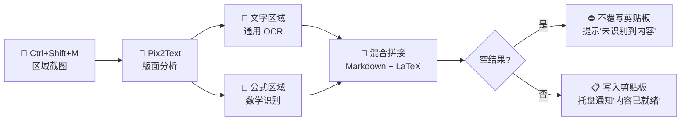

# FormulaSniper — 公式截图秒转 LaTeX

<!-- markdownlint-disable MD033 -->
<p align="center">
  <strong>⚡ 截图 → 识别 → LaTeX 入剪贴板 → 粘贴到 Obsidian</strong>
</p>
<p align="center">
  <a href="README_EN.md">English</a>
</p>

---

## 📖 这是什么？

在根据教科书制作电子笔记时，你遇到一个公式——

传统方式：手敲LaTex公式/截图后用在线识别工具识别公式 → 复制 → 粘贴到笔记。

**FormulaSniper 方式：按 `Ctrl+Shift+M` → 框选公式 → 切回笔记 → `Ctrl+V` 粘贴。**

项目自动将截图中的**文字**与**数学公式**识别为 Markdown + LaTeX 混合格式，直接入剪贴板，粘贴即用。

---

## 🚀 快速开始

### 环境要求

| 项目 | 要求 |
|------|------|
| Python | ≥ 3.10 |
| 操作系统 | Windows 10/11 |
| 磁盘空间 | ≥ 3 GB（模型首次下载） |
| GPU（可选） | 支持 CUDA 加速 |

### 安装步骤

```powershell
# 1. 克隆项目
git clone https://github.com/KangCod1ng/FormulaSniper.git
cd FormulaSniper

# 2. 创建虚拟环境
python -m venv .venv

# 3. 激活虚拟环境
.venv\Scripts\activate

# 4. 安装依赖
pip install -r requirements.txt

# 5. 启动应用
python main.py
# 或双击 `启动.bat`
```

首次运行会自动下载 Pix2Text 模型（约 1-2 GB），请耐心等待。后续启动即可秒开。

---

## 🎮 使用方式

1. 双击 `启动.bat` 或运行 `python main.py`
2. 应用以**系统托盘**形式常驻后台
3. 在任意界面（PDF 阅读器、浏览器、图片查看器）看到想识别的公式区域
4. 按下 **`Ctrl+Shift+M`**，框选目标区域
5. 等待 1-3 秒，托盘弹出气泡提示「内容已就绪」
6. 切回 Obsidian / Typora / VS Code，`Ctrl+V` 粘贴

---

## 🔧 工作原理



### 识别流水线

| 阶段 | 说明 |
|------|------|
| **版面分析** | 将截图分割为文字区块与公式区块 |
| **通用 OCR** | 文字区块 → 纯文本 |
| **公式识别** | 公式区块 → LaTeX（`$...$` 行内格式） |
| **结果拼接** | 按版面阅读顺序组装为混合 Markdown |

### 示例

> 截图内容：
>
> 设函数 $f(x)$ 在区间 $[a,b]$ 上连续，且 $F(x) = \int_a^x f(t)dt$，则 $F'(x) = f(x)$。

> 粘贴到 Obsidian 后自动渲染为：
>
> 设函数 $f(x)$ 在区间 $[a,b]$ 上连续，且 $F(x) = \int_a^x f(t)dt$，则 $F'(x) = f(x)$。

---

## ⌨️ 自定义快捷键

编辑 `config/default_settings.json`：

```json
{
  "hotkey": {
    "key": "m",
    "modifiers": ["ctrl", "shift"]
  }
}
```

- `key`：触发键（`m` / `f` / `s` 等）
- `modifiers`：修饰键列表（`ctrl` / `shift` / `alt`）

修改后重启应用生效。

---

## ⚙️ 配置项

| 配置项 | 默认值 | 说明 |
|--------|--------|------|
| `hotkey.key` | `m` | 快捷键触发键 |
| `hotkey.modifiers` | `["ctrl", "shift"]` | 快捷键修饰键 |
| `ocr.device` | `cpu` | 推理设备（`cpu` / `cuda`） |
| `behavior.auto_copy_to_clipboard` | `true` | 识别后自动写入剪贴板 |
| `behavior.show_notification` | `true` | 显示托盘通知 |
| `behavior.notification_duration_ms` | `3000` | 通知显示时长（毫秒） |
| `models.cache_dir` | `./models` | 模型缓存目录 |
| `models.auto_download` | `true` | 自动下载缺失模型 |

---

## 📁 项目结构

```
FormulaSniper/
├── main.py                  # 应用入口
├── 启动.bat                 # Windows 一键启动脚本
├── requirements.txt         # 依赖清单
├── config/
│   └── default_settings.json  # 默认配置
├── assets/                  # 图标等资源
└── src/
    ├── app.py               # 主应用（生命周期、流水线编排）
    ├── sniper/
    │   ├── capture.py       # 全局热键 + 截图捕获
    │   ├── ocr_engine.py    # Pix2Text 引擎封装
    │   ├── clipboard.py     # 剪贴板读写管理
    │   ├── notifier.py      # 托盘通知
    │   └── settings.py      # 配置管理
    └── ui/
        ├── tray.py          # 系统托盘 + 右键菜单
        └── region_selector.py  # 全屏透明区域选择器
```

---

## 🧪 技术栈

| 组件 | 技术 |
|------|------|
| GUI 框架 | PySide6 |
| 截图捕获 | keyboard + mss |
| OCR 引擎 | [Pix2Text](https://github.com/breezedeus/Pix2Text) |
| 图像处理 | Pillow |
| 剪贴板 | pyperclip |
| 系统托盘 | PySide6 QSystemTrayIcon |

---

## ❓ 常见问题

### Q: 首次启动很慢？
首次运行需下载 Pix2Text 模型（约 1-2 GB），下载进度会显示在终端中。后续启动无需重新下载。

### Q: 截图后没反应？
- 检查键盘钩子是否被安全软件拦截
- 确认快捷键未被其他程序占用
- 查看终端输出排查错误

### Q: 公式识别不准？
- 确保截图区域清晰、公式完整
- 尝试在 `config/default_settings.json` 中切换 `ocr.device` 为 `cuda`（需 NVIDIA GPU）
- Pix2Text 对标准印刷体公式识别效果最佳，手写体准确率较低

### Q: 如何关闭？
右键系统托盘图标 → 点击「退出」。或终端按 `Ctrl+C`。

### Q: 支持 macOS / Linux 吗？
当前仅支持 Windows。全局热键依赖 `keyboard` 库（Windows 表现最佳），跨平台适配计划中。

---

## 📄 许可

MIT License

---

<p align="center">
  <sub>Made with ❤️ for note-takers</sub>
</p>
