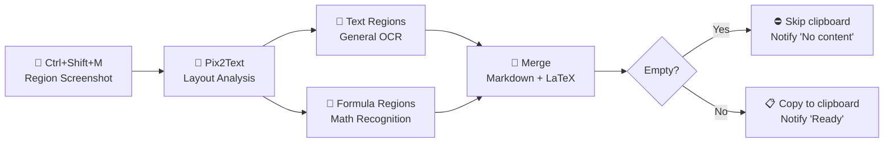

# FormulaSniper — Screenshot Formulas to LaTeX Instantly

<!-- markdownlint-disable MD033 -->
<p align="center">
  <strong>⚡ Screenshot → OCR → LaTeX to Clipboard → Paste into Obsidian</strong>
</p>
<p align="center">
  <a href="README.md">中文</a>
</p>

---

## 📖 What Is This?

Making digital notes from textbooks, you encounter a formula —

The old way: type LaTeX by hand / use an online OCR tool → copy → paste.

**The FormulaSniper way: press `Ctrl+Shift+M` → select the formula → switch back to your notes → `Ctrl+V`.**

The app automatically recognizes both **text** and **math formulas** in your screenshot and converts them into a Markdown + LaTeX mixed format, ready in your clipboard.

---

## 🚀 Quick Start

### Requirements

| Item | Requirement |
|------|-------------|
| Python | ≥ 3.10 |
| OS | Windows 10 / 11 |
| Disk | ≥ 3 GB (for model download on first run) |
| GPU (optional) | CUDA-compatible for acceleration |

### Installation

```powershell
# 1. Clone the repo
git clone https://github.com/KangCod1ng/FormulaSniper.git
cd FormulaSniper

# 2. Create a virtual environment
python -m venv .venv

# 3. Activate it
.venv\Scripts\activate

# 4. Install dependencies
pip install -r requirements.txt

# 5. Launch
python main.py
# Or double-click `启动.bat`
```

On first run, the Pix2Text model (~1–2 GB) will be downloaded automatically. Subsequent launches are instant.

---

## 🎮 How to Use

1. Double-click `启动.bat` or run `python main.py`
2. The app lives in your **system tray**, always ready
3. Whenever you see a formula (PDF reader, browser, image viewer), press **`Ctrl+Shift+M`**
4. Drag to select the region
5. Wait 1–3 seconds — a tray balloon will say "Ready"
6. Switch back to Obsidian / Typora / VS Code and `Ctrl+V`

---

## 🔧 How It Works



### Recognition Pipeline

| Stage | Description |
|-------|-------------|
| **Layout Analysis** | Split the screenshot into text blocks and formula blocks |
| **General OCR** | Text blocks → plain text |
| **Formula Recognition** | Formula blocks → LaTeX (inline `$...$` format) |
| **Result Assembly** | Merge by reading order into a mixed Markdown string |

### Example

> Screenshot content:
>
> Let $f(x)$ be continuous on $[a,b]$, and $F(x) = \int_a^x f(t)dt$, then $F'(x) = f(x)$.

> After pasting into Obsidian, it renders as:
>
> Let $f(x)$ be continuous on $[a,b]$, and $F(x) = \int_a^x f(t)dt$, then $F'(x) = f(x)$.

---

## ⌨️ Custom Hotkey

Edit `config/default_settings.json`:

```json
{
  "hotkey": {
    "key": "m",
    "modifiers": ["ctrl", "shift"]
  }
}
```

- `key` — trigger key (`m`, `f`, `s`, etc.)
- `modifiers` — modifier keys (`ctrl`, `shift`, `alt`)

Restart the app after changes.

---

## ⚙️ Configuration

| Setting | Default | Description |
|---------|---------|-------------|
| `hotkey.key` | `m` | Trigger key |
| `hotkey.modifiers` | `["ctrl", "shift"]` | Modifier keys |
| `ocr.device` | `cpu` | Inference device (`cpu` / `cuda`) |
| `behavior.auto_copy_to_clipboard` | `true` | Auto-copy after recognition |
| `behavior.show_notification` | `true` | Show tray notification |
| `behavior.notification_duration_ms` | `3000` | Notification duration (ms) |
| `models.cache_dir` | `./models` | Model cache directory |
| `models.auto_download` | `true` | Auto-download missing models |

---

## 📁 Project Structure

```
FormulaSniper/
├── main.py                  # Entry point
├── 启动.bat                 # Windows one-click launcher
├── requirements.txt         # Dependencies
├── config/
│   └── default_settings.json  # Default settings
├── assets/                  # Icons & resources
└── src/
    ├── app.py               # App lifecycle & pipeline orchestration
    ├── sniper/
    │   ├── capture.py       # Global hotkey + screenshot capture
    │   ├── ocr_engine.py    # Pix2Text engine wrapper
    │   ├── clipboard.py     # Clipboard read/write
    │   ├── notifier.py      # Tray notifications
    │   └── settings.py      # Settings manager
    └── ui/
        ├── tray.py          # System tray & context menu
        └── region_selector.py  # Full-screen transparent region selector
```

---

## 🧪 Tech Stack

| Component | Technology |
|-----------|------------|
| GUI | PySide6 |
| Screenshot | keyboard + mss |
| OCR Engine | [Pix2Text](https://github.com/breezedeus/Pix2Text) |
| Image Processing | Pillow |
| Clipboard | pyperclip |
| System Tray | PySide6 QSystemTrayIcon |

---

## ❓ FAQ

### Q: First launch is slow?
The Pix2Text model (~1–2 GB) is downloaded on first run. Progress is shown in the terminal. Subsequent launches skip this.

### Q: Nothing happens after taking a screenshot?
- Check if your security software is blocking the keyboard hook
- Make sure the hotkey isn't taken by another app
- Check the terminal output for errors

### Q: Formula recognition is inaccurate?
- Ensure the screenshot is clear and the formula is fully captured
- Try setting `ocr.device` to `cuda` in `config/default_settings.json` (requires NVIDIA GPU)
- Pix2Text works best on printed formulas; handwriting accuracy is lower

### Q: How do I quit?
Right-click the tray icon → "Exit". Or press `Ctrl+C` in the terminal.

### Q: macOS / Linux support?
Currently Windows only. The global hotkey relies on the `keyboard` library (best on Windows). Cross-platform support is planned.

---

## 📄 License

MIT License

---

<p align="center">
  <sub>Made with ❤️ for note-takers</sub>
</p>
